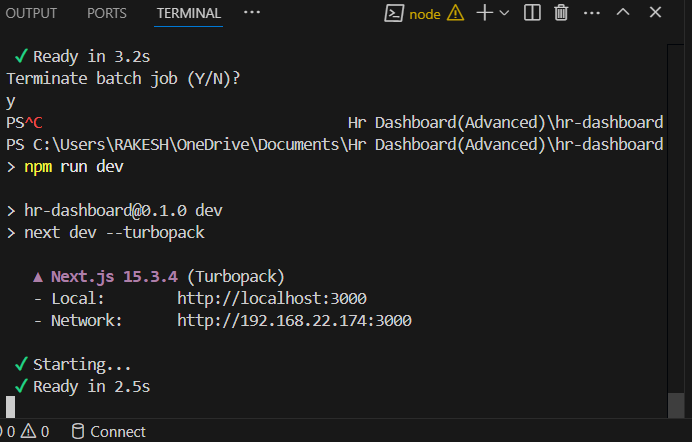
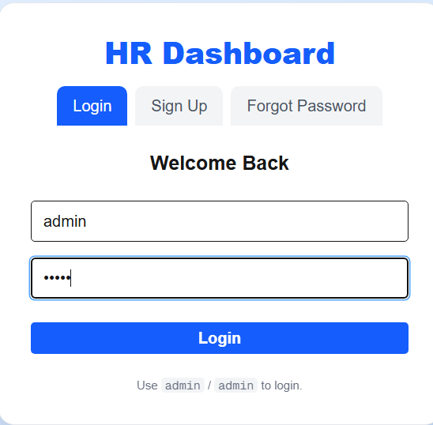
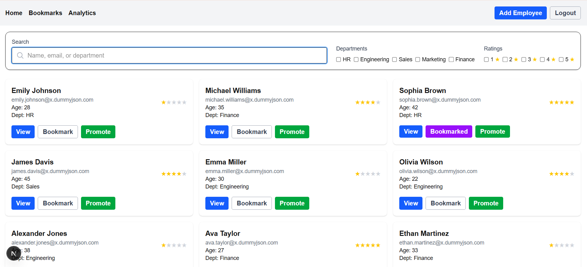
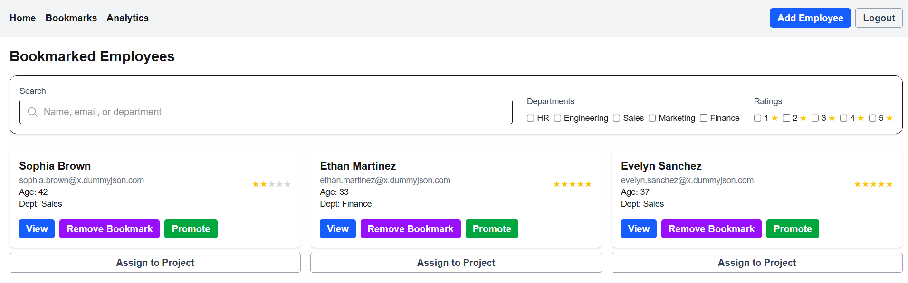
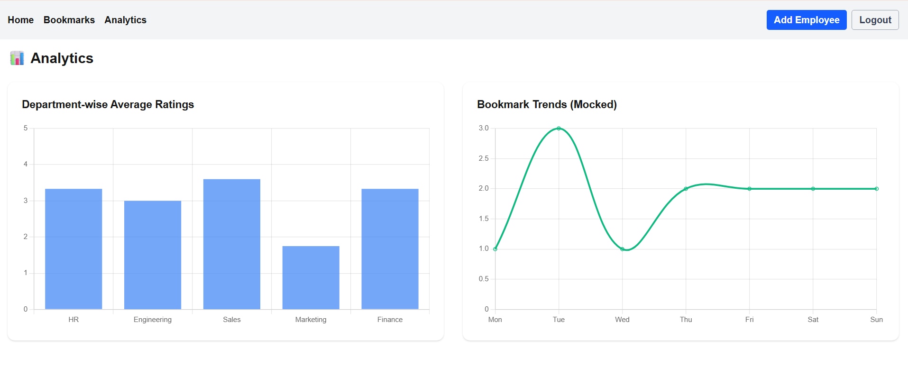
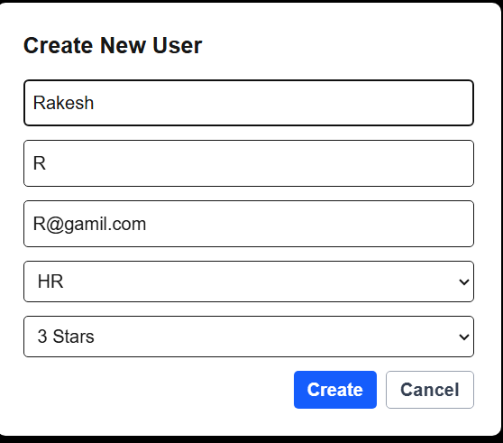
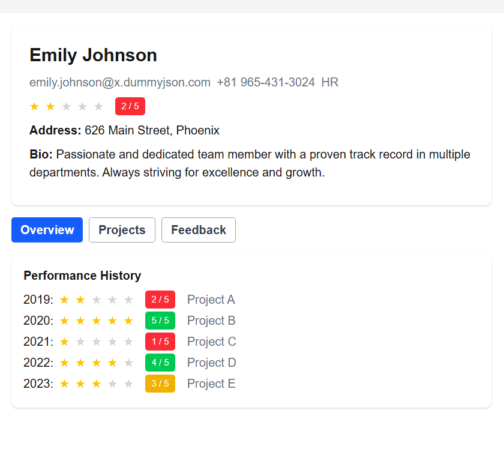

# HR Dashboard

A modern HR Dashboard built with Next.js, Zustand, and Tailwind CSS.

---

## 🚀 Features

- **Authentication:**
  - Login required for all pages (default: `admin` / `admin`)
  - Signup and Forgot Password UI (UI only, logic coming soon)
- **Employee Management:**
  - Add Employee (global modal, works on any page)
  - View, filter, and bookmark employees
  - Search, department, and rating filters (sticky filter bar)
- **Bookmarks:**
  - Bookmark employees for quick access
  - Filter and search bookmarks
- **Analytics:**
  - Placeholder for analytics dashboard
- **Responsive Design:**
  - Works on desktop and mobile
  - Sticky navbar and filter bar

---

## 🛠️ Setup Instructions

1. **Clone the repository:**
   ```bash
   git clone https://github.com/your-username/hr-dashboard.git
   cd hr-dashboard
   ```
2. **Install dependencies:**
   ```bash
   npm install
   ```
3. **Run the development server:**
   ```bash
   npm run dev
   ```

Open `http://localhost:3000` in your browser.

---

## 📝 Usage

- **Login:**
  - Go to `/login` and use
    - Username: `admin`
    - Password: `admin`

- **Add Employee:**
  - Click the "Add Employee" button in the navbar (works on any page).

- **Bookmarks & Analytics:**
  - Use the navbar links to access Bookmarks and Analytics pages.

- **Search & Filter:**
  - Use the sticky filter bar to search and filter employees or bookmarks.

---

## 📸 Screenshots


<p align="center">
  
</p>

### 🔐 Login Page

<p align="center">
  
</p>

### 🏠 Dashboard

<p align="center">
  
</p>

### 📌 Bookmarks Page

<p align="center">
  
</p>

### 📊 Analytics Page

<p align="center">
  
</p>

### ➕ Add New Employee

<p align="center">
  
</p>

### 👤 Employee Details Page

<p align="center">
  
</p>

## 📦 Submission

- **GitHub Repository Link:**
  - `https://github.com/your-username/hr-dashboard`

  Make sure your repo is public and has a valid commit history.

- **GitHub Deployment Link:**
  - `https://your-hr-dashboard.vercel.app`

  Deploy using Vercel, Netlify, or any other platform and share the live link.

---

## 📂 Project Structure

```
src/
  app/
    page.tsx              # Home (Employee list)
    bookmarks/page.tsx    # Bookmarks page
    analytics/page.tsx    # Analytics page (placeholder)
    login/page.tsx        # Combined Login/Signup/Forgot Password
  components/
    UserCard.tsx
    UserDetailModal.tsx
    CreateUserModal.tsx
    SearchFilterBar.tsx
    CreateUserNavButton.tsx
  context/
    CreateUserModalContext.tsx
  store/
    authStore.ts
    bookmarkStore.ts
    searchFilterStore.ts
    userDetailStore.ts
  types/
    User.ts
```


